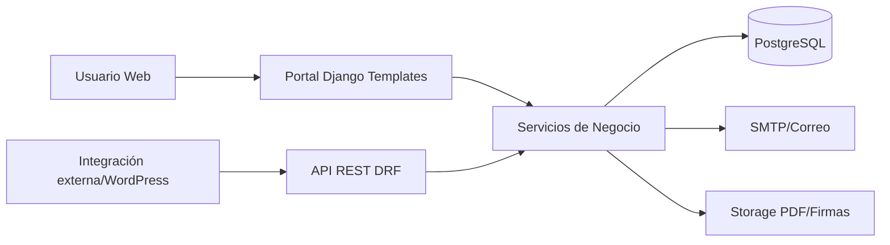
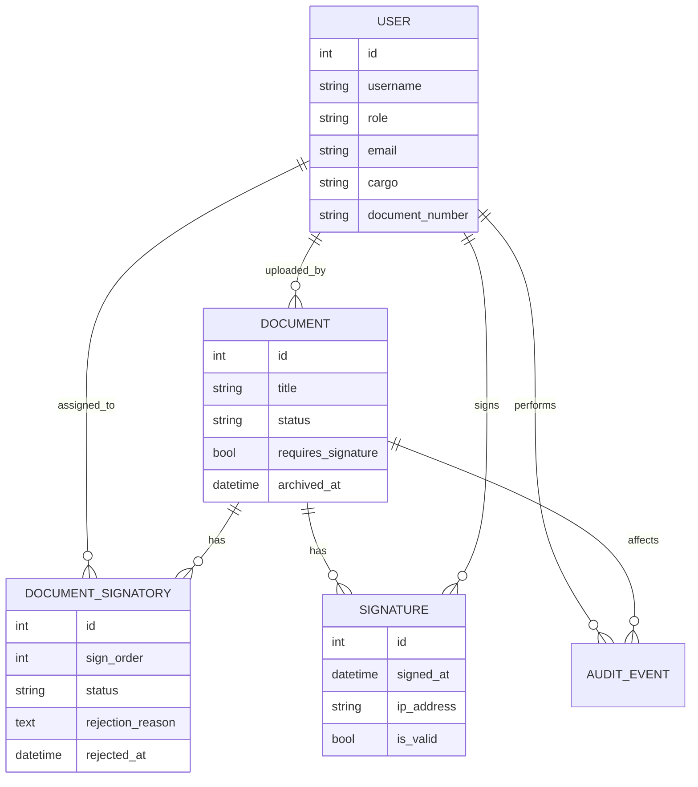
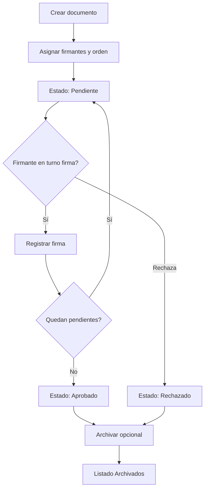

# Documentación Integral de AcoSignature

## 1. Resumen Ejecutivo

**AcoSignature** es una plataforma web para gestión documental y firma digital secuencial, desarrollada con arquitectura fullstack en Django. Permite crear documentos PDF, definir firmantes con orden estricto, ejecutar flujo de firma por turnos, gestionar rechazos con trazabilidad, notificar por correo, generar versión firmada del PDF y administrar ciclo de vida documental (archivado/eliminación bajo reglas de negocio).

Esta documentación consolida:
- Arquitectura funcional y técnica.
- Modelo de datos y reglas de negocio.
- Endpoints web y API.
- Manual de usuario por procesos.
- Seguridad, despliegue y operación.
- Diagnóstico de fallas frecuentes.

---

## 2. Alcance Funcional

### 2.1 Gestión de usuarios
- Inicio/cierre de sesión en portal.
- Autenticación API con JWT.
- Perfil de usuario editable (datos, contacto, cargo, firma guardada).
- Cambio de contraseña.

### 2.2 Gestión documental
- Creación de documento PDF con metadatos.
- Asignación de firmantes.
- Definición de orden de firma (secuencial).
- Visualización de detalle y estados.
- Descarga de documento firmado.

### 2.3 Flujo de firma digital
- Firma en 3 pasos (revisión -> captura -> confirmación).
- Modalidades de firma:
  - Dibujo en canvas.
  - Firma guardada de perfil.
  - Carga de imagen de firma.
- Validación de imágenes permitidas (JPG/JPEG/PNG/WEBP/GIF/BMP).

### 2.4 Rechazos y decisiones
- Rechazo por firmante (con motivo).
- Rechazo global del documento bajo reglas de flujo.
- Visualización de quién rechazó y razón.

### 2.5 Bandejas y productividad
- Bandeja principal de aprobaciones.
- Tarjetas responsive para móvil/desktop.
- Sección de archivados separada del principal.
- Paginación de archivados (15 inicial + 10 por “Ver más”).

### 2.6 Ciclo de vida documental
- Archivar documentos cerrados (aprobados/rechazados/firmados).
- Eliminar documento con confirmación modal.
- Regla de bloqueo de eliminación si está firmado por todos.

### 2.7 Notificaciones
- Correo de asignación de firmante (HTML + texto).
- Enlace directo al documento.
- Fallback robusto ante errores SMTP sin romper flujo transaccional.

---

## 3. Arquitectura de la Solución

### 3.1 Diagrama de alto nivel

### 3.2 Apps y responsabilidades
- `accounts`: usuarios, roles, auth JWT, endpoints de perfil/auth.
- `documents`: documentos, firmantes, API de documentos, notificaciones.
- `signatures`: registro de firmas y endpoints de firma/listado.
- `workflows`: reglas de negocio y auditoría de eventos.
- `portal`: UI web, formularios y flujos operativos.
- `config`: settings, seguridad, rutas globales.

---

## 4. Modelo de Datos

### 4.1 Entidades clave
- **User** (`accounts.User`): usuario con rol, firma guardada, documento, cargo.
- **Document** (`documents.Document`): documento principal, estado, archivo base, archivo firmado, archivado.
- **DocumentSignatory** (`documents.DocumentSignatory`): relación documento-firmante con estado individual y `sign_order`.
- **Signature** (`signatures.Signature`): evidencia de firma con fecha e IP.
- **AuditEvent** (`workflows.AuditEvent`): trazabilidad de acciones críticas.

### 4.2 Diagrama entidad-relación

---

## 5. Flujo Funcional de Negocio

### 5.1 Flujo principal de documento

### 5.2 Reglas críticas
1. Solo firma/rechaza el firmante en turno (`sign_order` pendiente más bajo).
2. Si no es turno, se bloquea acción y se informa quién está pendiente.
3. Documento finaliza al aprobarse por todos o al primer rechazo según flujo.
4. Archivado solo para documentos cerrados.
5. Eliminación bloqueada si todos firmaron.

---

## 6. Endpoints

### 6.1 Web (Portal)
- `/` Inicio.
- `/login/`, `/logout/`.
- `/mi-perfil/`.
- `/aprobaciones/` listado principal.
- `/aprobaciones/archivados/` archivados.
- `/aprobaciones/nuevo/` crear.
- `/aprobaciones/<id>/` detalle.
- `/aprobaciones/<id>/pdf/` visualizar PDF.
- `/aprobaciones/<id>/pdf-firmado/` descargar firmado.
- `/aprobaciones/<id>/aprobar/`, `/rechazar/`, `/firmar/`.
- `/aprobaciones/<id>/archivar/`, `/eliminar/`.

### 6.2 API REST
- `POST /api/auth/login/`
- `POST /api/auth/refresh/`
- `GET /api/auth/me/`
- `POST /api/users/register/`
- `GET /api/users/me/`
- CRUD `/api/documents/`
- `POST /api/documents/{id}/approve/`
- `POST /api/documents/{id}/reject/`
- `POST /api/signatures/sign/`
- `GET /api/signatures/document/{id}/`

---

## 7. Seguridad y Cumplimiento Técnico

### 7.1 Controles aplicados
- JWT para API (`Bearer`).
- `@login_required` en portal.
- Validación de permisos por rol y pertenencia documental.
- Throttling por scopes (`auth`, `documents`).
- Headers de seguridad HTTP.
- Cookies seguras en producción.
- CORS y CSRF configurables por entorno.

### 7.2 Auditoría
- Registro de acciones (login, firma, aprobación, rechazo) vía `AuditEvent`.
- Metadata adicional para análisis y soporte.

---

## 8. Manual de Usuario

### 8.1 Iniciar sesión
1. Ir a `/login/`.
2. Ingresar usuario/contraseña.
3. Al autenticar, entrar a bandeja de aprobaciones.

### 8.2 Crear documento
1. Ir a `Aprobaciones > Nuevo documento`.
2. Completar título, descripción y PDF.
3. Definir firmantes y orden.
4. Confirmar envío.

### 8.3 Firmar un documento
1. Abrir documento pendiente.
2. Verificar que sea tu turno.
3. Elegir método de firma (dibujar/guardada/subir).
4. Confirmar firma.

### 8.4 Rechazar un documento
1. Abrir documento en turno.
2. Seleccionar `Rechazar`.
3. Registrar motivo.
4. Confirmar.

### 8.5 Archivar documento
1. Desde tarjeta de documento cerrado, usar `Archivar`.
2. Ver en `Documentos archivados`.

### 8.6 Eliminar documento
1. Desde tarjeta, usar `Eliminar`.
2. Confirmar en modal “¿Está seguro de eliminar este documento?”.
3. El sistema elimina si cumple reglas (no completamente firmado).

### 8.7 Uso desde correo
- El botón “Revisar documento” redirige al login si no hay sesión.
- Tras login, retorna al documento (parámetro `next`).

---

## 9. Operación y Despliegue

### 9.1 Entornos
- Local: `.env.local.example`
- Producción: `.env.prod.example`

### 9.2 Variables clave
- `DJANGO_SECRET_KEY`, `DJANGO_DEBUG`, `DJANGO_ALLOWED_HOSTS`
- `DATABASE_URL` (recomendado)
- `EMAIL_BACKEND`, `EMAIL_HOST`, `EMAIL_PORT`, `EMAIL_HOST_USER`, `EMAIL_HOST_PASSWORD`
- `DEFAULT_FROM_EMAIL`, `PORTAL_BASE_URL`, `SIGNATORY_ASSIGNMENT_EMAIL_ENABLED`
- `CORS_ALLOWED_ORIGINS`

### 9.3 Render / producción
- Build con dependencias + collectstatic.
- Migraciones en deploy.
- Logs estructurados JSON para soporte.

---

## 10. Troubleshooting

### 10.1 No se envían correos
- Verificar `EMAIL_BACKEND` correcto (`django.core.mail.backends.smtp.EmailBackend`).
- Validar app password en Gmail (si aplica).
- Confirmar `SIGNATORY_ASSIGNMENT_EMAIL_ENABLED=True`.
- Revisar logs de SMTP.

### 10.2 Usuario sin acceso desde enlace de correo
- Comportamiento esperado: si no hay sesión, redirige a login.
- Si persiste 403: revisar pertenencia del usuario como firmante.

### 10.3 No permite firma
- Posibles causas:
  - no es turno,
  - documento ya cerrado,
  - usuario no está asignado.

### 10.4 Error en creación por correo
- Validar backend SMTP.
- La notificación está protegida para no tumbar transacción de negocio.

---

## 11. Estructura de Código Relevante

- `config/settings.py` configuración general y seguridad.
- `config/urls.py` rutas web y API.
- `portal/views.py` flujos web, archivado, eliminación.
- `portal/forms.py` validaciones de formularios.
- `documents/models.py` entidades documentales y firmantes.
- `documents/views.py` API de documentos.
- `documents/services.py` generación de PDF firmado.
- `documents/notifications.py` correo de asignación.
- `signatures/serializers.py` lógica API de firma.
- `workflows/services.py` reglas de negocio y estados.

---

## 12. Recomendaciones de Evolución

1. Añadir “Desarchivar” con trazabilidad.
2. Exportar reportes por estado/usuario/rango de fecha.
3. Incorporar firma con certificado digital externo (si se requiere validez avanzada).
4. Cola asíncrona para correo y tareas pesadas (Celery/RQ).
5. Dashboard operativo con métricas de throughput y tiempos de firma.

---

## 13. Glosario

- **Firmante en turno:** usuario habilitado actualmente para firmar/rechazar.
- **Documento cerrado:** documento en estado final (aprobado/rechazado/firmado según flujo).
- **Archivado:** oculto de bandeja principal y visible en índice de archivados.
- **Firma evidencial:** captura visual y metadata (IP/fecha) registrada por el sistema.

---

**Documento generado:** Abril 2026  
**Producto:** AcoSignature  
**Tipo:** Documentación funcional, técnica y manual de usuario
